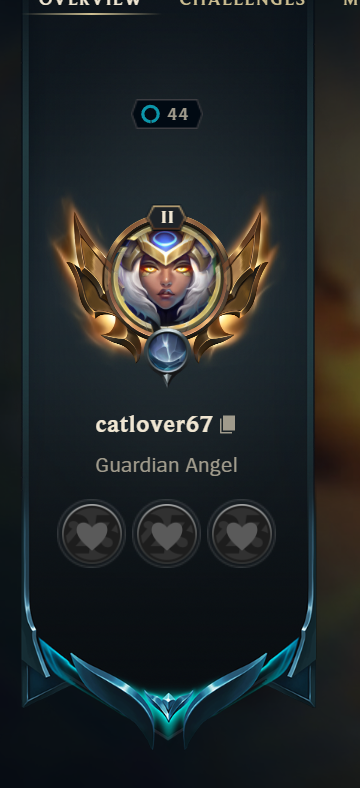
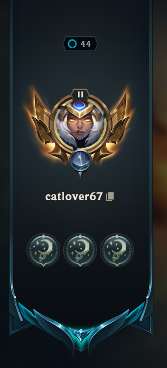

# Introduction

Okay so I used a tool a few years ago called [League Tools](https://github.com/7rebux/league-tools) and it broke. So I wanted to figure out if I could do my own script for changing triple tokens.

## Usage

### Prerequisites:
- Python 3.8+
- Requests Library
```bash
pip install requests
```
- League of Legends Client (must be open)

### Running
Download the python script and run it.
```bash
py set_tokens_with_logs.py
```

### How to find the Token ID
1. visit this [website](https://challenges.darkintaqt.com/)
2. search for your token and copy the digits from the URL

## Screenshots


